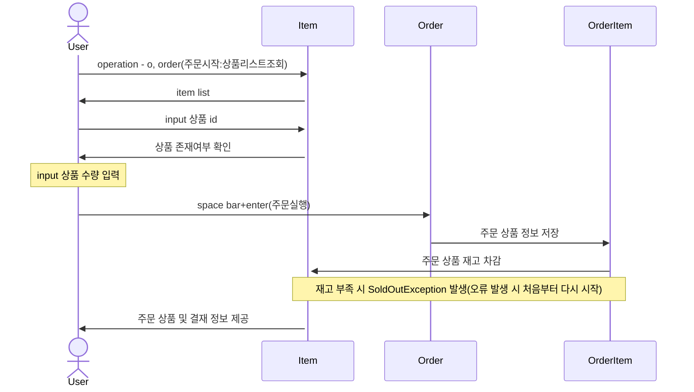

# homework - 상품 주문 프로그램

## 프로젝트 실행
HomeworkApplication.java 실행 -> h2 db에 테이블 생성 및 데이터 적제(data.sql 내부 쿼리로 인하여 데이터 삽입)
-> OrderApplication가 실행 되며 console을 통해서 주문 프로그램을 사용할 수 있습니다. 

## 일정 관리 
https://github.com/users/chaechaeyi/projects/3/views/4

## Environments
* Amazon Corretto Version 17.0.7
* Spring Boot 3.1.0
* Gradle 
* H2
* JPA 
* lombok 

## 데이터 연관관계 (ERD)
document 패키지 아래 : 주문프로그램.데이터연계도.svg 참고 부탁드립니다.

## Process
### 이용권 만료

## 프로젝트 회고
퇴사 이후 1개월동안 jpa 공부를 하였던 것을 이번 과제 테스트를 기회로 구현을 해 보았습니다. 
기존 회사에서 사용하던 mybatis와는 달리 직접적으로 sql문을 작성하지 않아도 되는 부분이 흥미로었던 것 같습니다. 
어노테이션을 통해서 관계를 매핑하고 복잡한 join문의 경우에는 상황이 다르겠지만 어노테이션을 가지고 정의 할 수 있는 부분도 흥미로웠습니다.

multi thread로 동시성 테스트 부분은 아쉬운 점이 있었습니다. 
isolation = Isolation.SERIALIZABLE를 통해서 제어를 하였는데 db level에서 lock을 걸 경우 db conection, dist i/o를 통해 비효율이 발생하므로 
redis 등을 통해서 동시성을 제어하면 어땠을까 아쉬움이 남아 해당 프로젝트는 만족할 때까지 conversion 예정입니다. 
