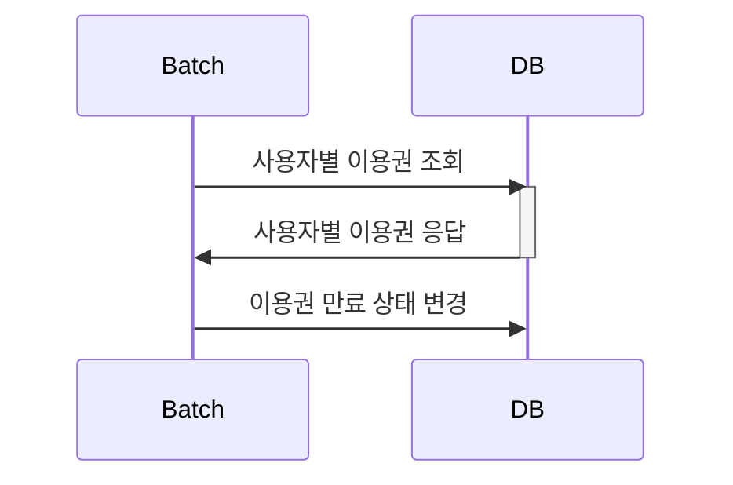

# homework - 상품 주문 프로그램

## 프로젝트 실행
HomeworkApplication.java 실행 -> h2 db에 테이블 생성 및 데이터 적제(data.sql 내부 쿼리로 인하여 데이터 삽입)
-> OrderApplication가 실행 되며 console을 통해서 주문 프로그램을 사용할 수 있습니다. 

## 일정 관리 
https://github.com/users/chaechaeyi/projects/3/views/4

## Environments
* Amazon Corretto Version 17.0.7
* Spring Boot 3.1.0
* Gradle 
* H2
* JPA 
* lombok 

## 데이터 연관관계 (ERD)

## Process
### 이용권 만료

